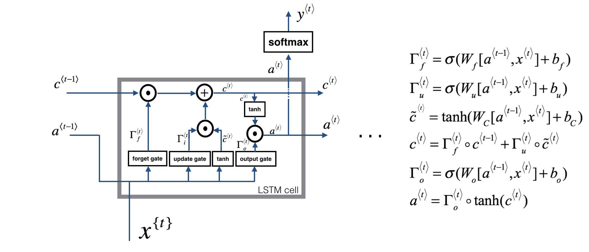
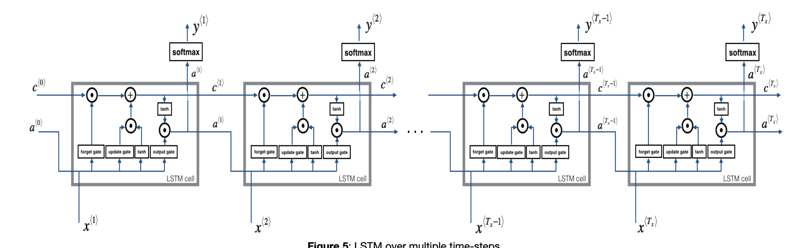

# RNN-LSTM-from-scratch
Implementation of a RNN and a LSTM from scratch - using numpy only. No deep learning framework used! This exercise set me up with a solid foundation for future deep learning research (an area that I am eager to continue exploring). I Did this as an assignment for my deep learning specialization on coursera.

# learning goals:
1. I had the opportunity to understand a Recurrent Neural Netowrk in depth. I got the chance to understand all the low-level components that make up this network.
2. I fully understood what goes on behind the scenes when I implement a RNN in deep learning frameworks (such as Tensorflow, Keras, etc)
3. I got to know the most famous type of RNN, a Long Short Term Memory network.
4. I fully understood the complicated calculations that a LSTM does, and why it is very useful for Natural Language Understanding.
5. Even though I won't be implementing RNN from scratch for real world applications, I find it very interesting how Neural Networks work and behave.

